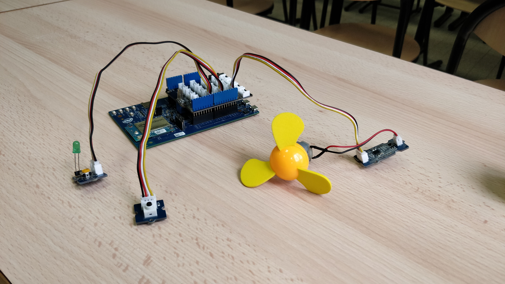
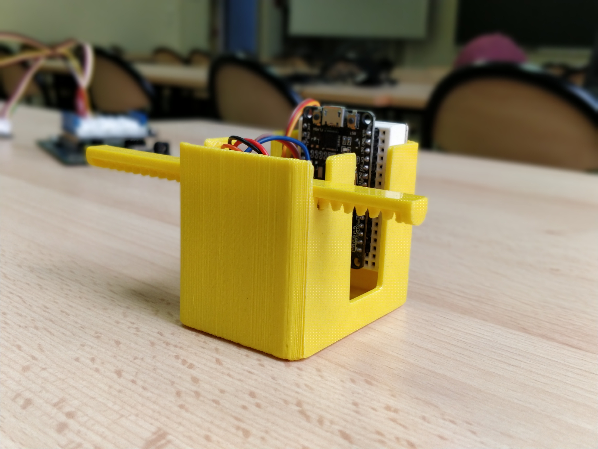

# smart-home-4A
Smart Home project

## Overview of the project ##
When a **facial expression** is detected thanks to a **Kinect** camera, it triggers different actions : switching on/off a fan, lighting an LED, triggering the coffee machine. **OM2M** framework has been used as the link between the hardware and the software, an **Android app** on which the user can choose which action corresponds to an expression.
**Watch the video of the project : https://www.youtube.com/watch?v=yCqT34IbnhM**

## Content ##
This repository contains the codes for the **ESP32** controller to which a servomotor is connected, and the codes for the **Intel Edison** to which a fan and an LED are connected.
The **REST requests** for OM2M are included in both codes.

## Visuals ##
The Edison with its actuators : 

The ESP32 with a servomotor in a 3D-printed box, design by : Maxime Castelli (Nelson project)

